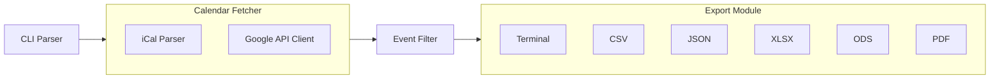

# Google Calendar Event Exporter CLI

## Architecture Overview



## Project Structure

```
cal_book_hours/
├── pyproject.toml          # Project config with dependencies
├── README.md               # Usage documentation
├── src/
│   └── cal_exporter/
│       ├── __init__.py
│       ├── __main__.py     # Entry point
│       ├── cli.py          # Argument parsing
│       ├── fetchers/
│       │   ├── __init__.py
│       │   ├── ical.py     # iCal URL fetcher
│       │   └── google_api.py  # Google Calendar API fetcher
│       ├── filters.py      # Date and hashtag filtering
│       └── exporters/
│           ├── __init__.py
│           ├── terminal.py
│           ├── csv_export.py
│           ├── json_export.py
│           ├── xlsx_export.py
│           ├── ods_export.py
│           └── pdf_export.py
```

## Key Dependencies

- **CLI**: `click` - User-friendly argument parsing
- **iCal**: `icalendar` - Parse .ics feeds
- **Google API**: `google-api-python-client`, `google-auth-oauthlib`
- **Date parsing**: `python-dateutil` - Flexible date/time input
- **XLSX**: `openpyxl`
- **ODS**: `odfpy`
- **PDF**: `reportlab`

## Implementation Details

### 1. CLI Interface (`cli.py`)

Using `click` for a clean interface:

```python
@click.command()
@click.option('-c', '--calendar', required=True, help='Calendar URL or ID')
@click.option('-s', '--search', multiple=True, help='Hashtags to filter')
@click.option('-d', '--date', default='today', help='Date filter (YYYY-MM-DD, range, or "today")')
@click.option('-w', '--write', type=click.Path(), help='Output file path')
@click.option('-e', '--export', type=click.Choice(['pdf','xlsx','ods','csv','json']), help='Export format')
@click.option('-t', '--terminal', is_flag=True, default=True, help='Output to terminal')
```

### 2. Calendar Fetching

**iCal fetcher**: Detect URLs ending in `.ics` or containing `ical` - fetch via `requests` and parse with `icalendar`.

**Google API fetcher**: For Calendar IDs, use the Google Calendar API. Requires a `credentials.json` file in the working directory.

### 3. Date Filtering (`filters.py`)

Support formats:

- Single date: `2026-02-01` or `today`
- Date range: `2026-02-01:2026-02-28`
- With time: `2026-02-01T09:00:2026-02-01T17:00`

Use `dateutil.parser` for flexible parsing.

### 4. Hashtag Filtering

Search event descriptions for strings starting with `#`. Match case-insensitively.

### 5. Exporters

Each exporter receives a list of filtered events and outputs in its format:

- **Terminal**: Rich table or formatted text
- **CSV/JSON**: Standard library
- **XLSX**: `openpyxl` workbook
- **ODS**: `odfpy` spreadsheet
- **PDF**: `reportlab` table layout

## Example Usage

```bash
# iCal URL, filter by #billable, today only, output to terminal
cal-exporter -c "https://calendar.google.com/calendar/ical/xxx/public/basic.ics" -s "#billable" -t

# Google API, date range, export to Excel
cal-exporter -c "primary" -d "2026-02-01:2026-02-28" -s "#project" -w report.xlsx -e xlsx
```